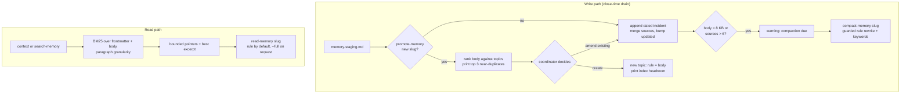

# Memory management review for the research project skill

Research project `2026-09-23-003`, 2026-09-23. Scope: the workspace memory layer only (`MEMORY.md`,
`memory/<slug>.md`, `POSTMORTEMS.md`, per-project `memory-staging.md`, `search-memory` and
`promote-memory`). Constraints: cross-host (Claude Code and Codex), Python 3.9 stdlib only, no
hooks, daemons, models or compiled extensions; memory stays advisory. Every number below was
produced by a script archived under the project's `artifacts/benchmark/` and recorded as evidence;
the reproduction commands are at the end. The live workspace was read but never modified.

## Summary and recommendation

The three-layer design in `memory-architecture.md` solved the problem it was built for: the
budgeted index is 8.2 KB and nothing loads topic bodies by default. Measured against the live
workspace five weeks later, the costs have moved to places the design does not budget:

- **Retrieval is the largest context cost and the weakest link.** The shipped `search-memory` finds
  an expected topic in 6% of queries (recall at 5) and returns a median 18.7 KB per query, of which
  a median 140 lines are post-mortem body matches and 1 line is a topic. It was used for two
  recorded queries across 65 projects. A stdlib BM25 ranker over topic bodies reaches 65% recall at
  5 and 81% at 10 while returning about 1 KB.
- **Topic bodies grow linearly with promotion and have no summary tier.** `promote-memory` only
  appends, so bytes track source count almost perfectly (Pearson 0.945, about 1.2 KB per source).
  Seven topics exceed 12 KB; opening the three largest costs about 14,800 tokens.
- **The index is the smallest cost today but has the nearest wall.** At the observed 212 bytes per
  pointer the 12 KB budget binds near 55 topics. Topics arrived at 7.2 per week over the five
  observed weeks, which leaves under three weeks of headroom, and the only remedy the design offers
  is a manual merge.

The recommendation is three phases, ordered by measured gain per unit of change:

1. **Retrieval first.** Replace substring matching with BM25 ranking over topic frontmatter and
   body at paragraph granularity, return bounded pointers with the best excerpt, make post-mortem
   search opt-in, and have `context` surface the top three memory candidates for the project's title
   and objective. This is the one change the benchmark can already score.
2. **Two tiers inside each topic.** A bounded `## Rule` section rewritten in place above an
   append-only `## Incidents` record, a `read-memory` command that returns the rule by default, and
   compaction due when a topic crosses a size or source threshold.
3. **Index relief without raising the budget.** Drop the scope clause from the rendered pointer,
   add a `retired` status that removes a topic from the index while keeping it searchable, report
   headroom at promotion time, and gate new slugs behind a near-duplicate check that uses the phase
   1 ranker.

Estimated effort is 4 to 7 focused days across the three phases, medium confidence, with the
plugin's 100% coverage rule and Codex parity testing as the main cost drivers.

## Measured state

Measured on 2026-09-23 by `measure_baseline.py`; evidence `ev-a35eb9ef`.

| Layer | Measure | Value |
| --- | --- | --- |
| `MEMORY.md` | Size | 8,156 B, 55 lines, about 2,000 tokens |
| | Budget and headroom | 12,288 B / 120 lines; 4,132 B headroom |
| | Topic pointers | 36; 167 to 314 B each, mean 212 B |
| | Pointer anatomy | link 35%, description 33%, scope 32% of pointer bytes |
| | Projected topics at budget | 55 at mean width, 37 if every pointer were the widest, 70 at the narrowest; the 120-line bound binds at 101 |
| Topics | Count and size | 36 files, 219,365 B, about 55,000 tokens |
| | Distribution | median 3,424 B, mean 6,093 B, max 23,279 B; 8 over 8 KB, 7 over 12 KB |
| | By kind | 18 method, 16 environment, 2 preference |
| | Sources per topic | median 2, mean 4.1, max 18; 46 distinct source projects of 72 |
| | Growth law | bytes versus sources Pearson 0.945; about 1,239 B per additional source |
| | Cost to open | three largest about 14,800 tokens; three median about 2,600 tokens |
| Post-mortems | Count and size | 65 files, 562,873 B, about 141,000 tokens; median 7,375 B, max 53,873 B |
| | `POSTMORTEMS.md` | 9,150 B, 73 lines, unbudgeted by design |
| Staging | Files | 45 projects have one; 10 non-empty; 8 of those hold a drain record rather than undrained lessons |
| Rates | Promotion | 0.5 new topics and 2.04 promotions per project; 7.2 new topics per week over 5 weeks |
| | Index growth | about 1,531 B per week; headroom lasts about 2.7 weeks at that rate |

The growth series by ISO week (topics created, cumulative, projected index bytes): week 35: 9, 9,
2,416; week 36: 3, 12, 3,054; week 37: 12, 24, 5,605; week 38: 11, 35, 7,943; week 39 (partial):
1, 36, 8,156. Week 38 alone closed 32 projects and created 11 topics.

The largest topics and their source counts: `reachable-failure-states` 23,279 B with 15 sources;
`record-what-was-untouched` 19,083 B with 18; `assert-the-destination` 16,837 B with 9;
`rule-in-prose-and-in-code` 16,730 B with 11; `fixtures-are-not-the-world` 15,209 B with 10. Only 4
of 36 topics contain any heading, so a reader has no way to stop early inside a body.

## How the layer is used today

- Since PR #26 the project skill no longer reads `MEMORY.md` at session start. The memory
  operations reference says to search only when a known pitfall could change the next action. So
  the index is not a per-session cost today; it is read on demand, at about 2,000 tokens.
- Records across all 72 projects mention `search-memory` 16 times, of which 2 are explicit recorded
  queries. Memory is consulted rarely, and when it is, the shipped output is dominated by
  post-mortem lines.
- Promotion happens at close. 46 of 72 projects promoted at least one lesson. The 2026-09-11 drain
  record shows the failure mode of the index budget in practice: three new topics pushed the file
  to 13,325 B, and the session spent its closing time merging pairs of topics and tightening scope
  lines by hand.
- Eight of the ten non-empty staging files are drain records written deliberately, which the close
  warning cannot distinguish from unfinished triage. Out of scope here, noted at the end.

Ranked by measured context cost, the priorities are therefore: search output (about 4,700 tokens
per query), topic bodies (up to 5,800 tokens per file), then the index (about 2,000 tokens, read on
demand). The user's concern about the index is right about the trajectory and the remedy, not about
today's cost.

## Retrieval benchmark

Method, from `bench_retrieval.py`; evidence `ev-15e135f2`, checksums unchanged `ev-55fba8b2`.

- **Ground truth.** For each of the 46 projects cited in any topic's `sources`, the citing topics
  are the expected hits (mean 3.2, max 7 per query). This rewards topics that were promoted, not
  topics that would have helped, which is why a popularity control is included.
- **Queries.** The project's canonical title plus its spec objective section (`full`), and the
  five highest-IDF terms of that text (`terse5`) to mimic a terse search.
- **Methods.** `popularity`: a static ranking by source count, the control. `current-kw3`: the
  shipped `search-memory` run through the working-tree launcher once per each of the query's three
  highest-IDF terms that occur anywhere in the corpus, hits unioned in return order. `fm-tfidf`:
  cosine TF-IDF over name, description and scope only. `bm25-head1500`: BM25 over frontmatter plus
  the first 1,500 bytes of the body. `bm25-topic`: BM25 over frontmatter plus the whole body.
  `bm25-section`: BM25 over paragraphs, topic scored by its best paragraph. `fts5-bm25`: SQLite FTS5
  with its built-in `bm25()`, run only because this machine has it.
- **Cost.** Median bytes returned for the top five hits, rendered as pointer lines for the
  prototypes and as actual stdout for the shipped tool.

| Method | R@3 | R@5 | R@10 | MRR | Median bytes at 5 |
| --- | --- | --- | --- | --- | --- |
| popularity (control) | 0.294 | 0.438 | 0.707 | 0.560 | 1,002 |
| current-kw3 (shipped) | 0.063 | 0.063 | 0.063 | 0.123 | 18,699 |
| fm-tfidf | 0.262 | 0.337 | 0.428 | 0.496 | 1,037 |
| bm25-head1500 | 0.398 | 0.462 | 0.651 | 0.589 | 1,014 |
| bm25-topic | 0.484 | 0.647 | 0.814 | 0.731 | 1,003 |
| bm25-section | 0.514 | 0.617 | 0.790 | 0.784 | 997 |
| fts5-bm25 | 0.509 | 0.657 | 0.868 | 0.754 | 1,002 |

With terse five-term queries: bm25-topic 0.517 at 5, bm25-section 0.520, fts5 0.561, fm-tfidf
0.169, shipped 0.063. The whole 46-query run, including 138 launcher invocations, took about 30
seconds; the in-process rankers are a negligible share of that.

What the table says:

- **The shipped search is structurally weak, not badly tuned.** It matches six frontmatter lines
  per topic and every line of 65 post-mortems, unranked. Across all queries it returned 142 topic
  lines and 14,290 post-mortem lines: a 100 to 1 noise ratio, at a median 18.7 KB per query.
- **Bodies carry the retrieval signal.** Frontmatter-only ranking (0.34) is below the popularity
  control (0.44); adding bodies lifts it to 0.65. Description and scope under-describe what a topic
  is about.
- **The honest gain is about +0.21 recall at 5 over popularity.** The control is strong because
  the ground truth favours well-cited topics; BM25 over bodies still beats it clearly, and with
  terse queries the gap holds (0.52 versus 0.44).
- **Truncation loses recall.** Indexing only the first 1,500 bytes of each body drops recall to
  0.46, barely above the control, because the head of a topic today is its first incident rather
  than a summary. Any compaction must preserve incident vocabulary in what remains searchable.
- **FTS5 buys nothing that matters here.** It ties the hand-written BM25 on this corpus and would
  add a second code path that is only sometimes available.
- **Section-level ranking wins on precision at the top (MRR 0.78)** and, more usefully, knows which
  paragraph matched, so it can return an excerpt instead of a filename.

## What others do and what survives the constraints

Eight designs were read (details and sources in the project's `artifacts/survey.md`). Everything
that depends on embeddings, vector or graph stores, background processes or host hooks was
excluded, as `memory-architecture.md` already concluded. What survives:

| Idea | From | Applied here as |
| --- | --- | --- |
| A small in-context tier rewritten in place, separate from a large searched archive | MemGPT / Letta | A bounded `## Rule` section above the append-only incident record |
| Consolidate at write time: compare with existing memories before adding | Mem0, LangMem | `promote-memory` runs the ranker over the new body and lists near-duplicates before a new slug is created |
| Notes carry keywords and a contextual description; amending a note revisits its attributes | A-MEM | A `keywords` field; amendment prompts a description and scope check |
| Reflection triggered when accumulated importance crosses a threshold | Generative Agents | Compaction due when a topic passes a size or source-count threshold |
| Strength decays and is reinforced on recall; facts are invalidated, not deleted | MemoryBank, Zep | `status: retired` and `superseded_by` frontmatter; a `read-memory` command that can record use |
| Index budget enforced at write time with a reminder near the limit; a `modified` timestamp per file | Claude Code auto memory | `promote-memory` prints headroom and warns near 85% of budget; `updated` already exists |

Claude Code's own auto memory is the closest relative: a `MEMORY.md` of one line per memory, topic
files loaded on demand, and a read limit of 200 lines or 25 KB with write-time nudges. Its budget is
about twice this layer's and its lines are shorter because they carry no scope clause.

## Options per priority

### Priority 1: index size and context cost

| Option | Effect on capacity | Cost | Verdict |
| --- | --- | --- | --- |
| A. Drop the scope clause from the rendered pointer; keep it in frontmatter for search | Scope is 32% of pointer bytes: mean pointer falls to about 145 B, budget binds near 80 topics | None to readers once search ranks on scope; a regeneration | Adopt |
| B. Also drop the explicit path from the pointer (the name determines it) | Mean pointer near 105 B; the 120-line bound then binds first, near 100 topics | Pointers stop being clickable links | Optional; adopt only if A is not enough |
| C. `status: retired` in frontmatter removes a topic from `MEMORY.md` but keeps it in `memory/` and searchable | Turns the index into the set of live topics; capacity becomes a function of curation, not history | One validation rule, one render filter | Adopt |
| D. Raise the budget | Linear, once | The cost the budget measures is real | Reject |
| E. Split the index by kind into three files | Three smaller reads | A reader who does not know the kind reads all three | Reject |
| F. Write-time headroom: `promote-memory` prints bytes used and warns at 85% | None on capacity; moves the pressure to the moment a person can act | A few lines | Adopt |
| G. Consolidation gate: `promote-memory` for a new slug first ranks the new body against existing topics and prints the top three | Slows topic creation to the rate of genuinely new lessons | Depends on the phase 1 ranker | Adopt |
| H. Replace the whole-file read with `list-memory --query` (the `list-projects` precedent) | The index stops being read whole at all | Only useful once ranking exists | Adopt as the phase 1 search output |

With A and C the observed 7.2 topics per week no longer maps to a fixed date on which the index
fails; it maps to a curation rate the tool reports at every promotion.

### Priority 2: topic body growth and compaction

| Option | Effect | Cost | Verdict |
| --- | --- | --- | --- |
| A. Two-tier topic file: `## Rule` (budgeted, rewritten in place) then `## Incidents` (append-only, dated, one entry per promotion) | A reader pays for the rule, about 1 to 2 KB, unless they ask for incidents | Format change; legacy files without `## Rule` are treated as rule-only | Adopt |
| B. `read-memory <slug>` returns frontmatter plus rule; `--incidents` or `--full` returns the rest | Bounded reads by default; reads become observable | One command; the skill must prefer it over generic file reads | Adopt |
| C. Compaction due as a validation warning when body bytes or source count pass a threshold (proposed 8 KB or 6 sources, the point where 8 topics sit today) | Makes the pressure visible where a person can act | One warning | Adopt |
| D. `compact-memory <slug>` guarded rewrite of the rule from a body file, with the previous rule kept as the newest incident entry | Rewrites become safe and provenance-preserving | One command under `.memory.lock` | Adopt |
| E. `keywords` frontmatter written at compaction with the incident vocabulary | Keeps a compacted topic retrievable; the head-1500 result shows why | One field | Adopt |
| F. Automatic summarisation of bodies by the tool | Not possible: no model in the tool, and merging is editorial | | Reject |
| G. Per-topic hard size cap | A cap on the archive makes depth expensive again, the trade the design deliberately made | | Reject |
| H. Split a topic that has accreted two subjects | Editorial; the 2026-09-16 merge shows judgement runs both ways | Coordinator procedure, no tooling | Document in `memory-operations.md` |

### Priority 3: retrieval quality and when memory is consulted

| Option | Effect | Cost | Verdict |
| --- | --- | --- | --- |
| A. BM25 over frontmatter plus body at paragraph granularity; output: topic, score, description, best excerpt; bounded to a limit | Recall at 5 from 0.06 to about 0.62 to 0.65; output from 18.7 KB to about 1 KB | About 150 lines of stdlib code plus tests | Adopt |
| B. Post-mortem search opt-in via `--include-postmortems` | Removes the 100 to 1 noise term by default | A flag | Adopt |
| C. `context` returns the top three memory candidates for the project's title and objective, bounded to about 600 bytes | Memory is consulted once per project without anyone remembering to search | Small addition to an existing command | Adopt |
| D. SQLite FTS5 when present, BM25 fallback otherwise | Ties BM25 here; two code paths | | Reject for now |
| E. Reload `MEMORY.md` at session start | Restores a fixed 2,000-token cost that PR #26 removed | | Reject |
| F. Recency or use weighting in the ranking | Needs the read path from priority 2 to exist first | | Defer to a later phase |

## Recommended design

The topic file becomes two tiers with the same six frontmatter fields plus two optional ones:

```markdown
---
name: reachable-failure-states
description: A check that cannot fail is not a check; an exit code may not be its own
kind: method
scope: an assertion, or an exit code as a verdict
sources: 2026-09-03-004, ...
updated: 2026-09-17
keywords: set -e, and-or list, grep -q, exit code, watcher filter, fixture   # optional, phase 2
status: active                                                               # optional, phase 3
---

## Rule

The rewritten, bounded statement of the lesson: what to do, when it applies, what it looks like
when it is being violated. Budgeted (proposed 2 KB, a warning not an error).

## Incidents

### 2026-09-17 — 2026-09-17-004
One dated paragraph per promotion, appended by `promote-memory`, never rewritten.
```



Read the diagram top to bottom. On the write side the only new decision point is the near-duplicate
check before a new slug, and the only new tool-driven pressure is the compaction warning; both hand
the decision to the coordinator rather than automating an editorial judgement. On the read side the
index is no longer on the path at all: `context` and `search-memory` rank, and `read-memory` bounds
what a hit costs.

State ownership and locks are unchanged: topic files are amended under `.memory.lock`, the index is
regenerated under `.index.lock`, staging stays per project. `compact-memory` is a read-modify-write
of one topic under `.memory.lock` with an expected-sha guard, the same shape as `edit ... spec`.

Failure behaviour worth stating:

- A topic without `## Rule` is legacy and is read whole; no migration is forced.
- A malformed topic still degrades to a warning at generation time and never blocks a commit.
- A rule over its budget warns; it does not fail validation, because the rule is advisory and a
  person can shorten it.
- Ranking with an empty corpus returns nothing and exits zero, as search does today.
- `retired` topics are excluded from `context` suggestions and from the default search unless
  `--include-retired` is passed, so a retired lesson stays recoverable.

## Phased plan, effort and migration

Units are focused implementer days for one engineer familiar with the plugin, tests included at
the plugin's 100% coverage rule, on both hosts. Confidence medium.

| Phase | Content | Effort | Depends on | Measure afterwards |
| --- | --- | --- | --- | --- |
| P1 Retrieval | BM25 ranker module (stdlib), `search-memory` ranked output with `--limit`, `--include-postmortems` opt-in, `context` top-three candidates, `memory-operations.md` update | 1 to 2 days | none | Re-run `bench_retrieval.py` with the shipped search as `current`: target R@5 at or above 0.60 and median output at or below 2 KB |
| P2 Topic tiers | `## Rule` and `## Incidents` format, `promote-memory` appends dated incidents, `read-memory`, `compact-memory`, `keywords`, compaction-due warning, format section in `memory-architecture.md` | 2 to 3 days | P1 for keyword-aware ranking | Count of topics over 8 KB without a rule; bytes returned by `read-memory` for the eight largest topics; re-run the benchmark to confirm compaction did not lower recall |
| P3 Index relief | Pointer without scope clause, `status: retired`, headroom report and 85% warning at promotion, near-duplicate gate | 1 to 2 days | P1 for the gate | Projected topics at budget from `measure_baseline.py`: target at or above 80; number of retired topics |
| Total | | 4 to 7 days | | |

Migration:

- **P1** needs none. Existing topics rank as they are.
- **P2** does not rewrite the 36 topics. The eight topics over 8 KB are the ones worth a written
  rule; at roughly fifteen minutes of coordinator time each that is about two hours, and it can be
  done one topic at a time as each is next touched. The other 28 remain rule-only legacy files until
  a promotion appends their first dated incident.
- **P3** is a regeneration. Pointer rendering changes on the next `rebuild-index`; no topic file
  changes unless a person retires one.

What could change the estimate: the `SKILL.md` plus `commands.md` word budget (any new command
documentation has to fit or live in `memory-operations.md`), the cost of Codex parity checks for the
new commands, and whether `context` gains the candidate list in its default output or behind a flag.

## Observations outside scope

Recorded, not analysed, per the specification:

- **Drain records defeat the staging warning.** Eight of ten non-empty staging files are records
  of a completed drain. A `--drained` marker, or truncation to the skeleton plus a one-line drain
  note in the reflection, would let the close warning mean what it says.
- **No read is observable.** Topics are read with generic file tools, so nothing can tell a
  well-used topic from a dead one. `read-memory` in P2 is the prerequisite for any use-based
  retirement.
- **`INDEX.md` churns on every commit of any project.** Harmless, but it is why a naive checksum
  of the workspace root differs between two reads; exclude it from integrity checks.
- **`memory-architecture.md` states FTS5 is not guaranteed in stock Python.** True in general, and
  the right conclusion, but this machine's `/usr/bin/python3` 3.9.6 does ship it (SQLite 3.51); the
  document could say "not guaranteed on every host" rather than implying absence.

## Reproduction

Scripts and raw outputs live under the project directory
`/Users/npham/git_tree/research/workspace/2026-09-23-003/artifacts/benchmark/`. Both are Python
3.9 stdlib and read-only; they write only the named output file.

```sh
ROOT=/Users/npham/git_tree/research/workspace
ART=$ROOT/2026-09-23-003/artifacts/benchmark
/usr/bin/python3 $ART/measure_baseline.py $ROOT $ART/baseline.json
/usr/bin/python3 $ART/bench_retrieval.py $ROOT \
  /Users/npham/git_tree/agents/plugins/research/skills/project/scripts/research-project \
  $ART/results.json
```

Evidence records in the project's `evidence.md`: checksums before `ev-dc689701`, baseline
`ev-a35eb9ef`, benchmark `ev-15e135f2`, checksums after the benchmark `ev-55fba8b2`, survey check
`ev-d8bf778d`. The survey with per-design sources is `artifacts/survey.md`.
